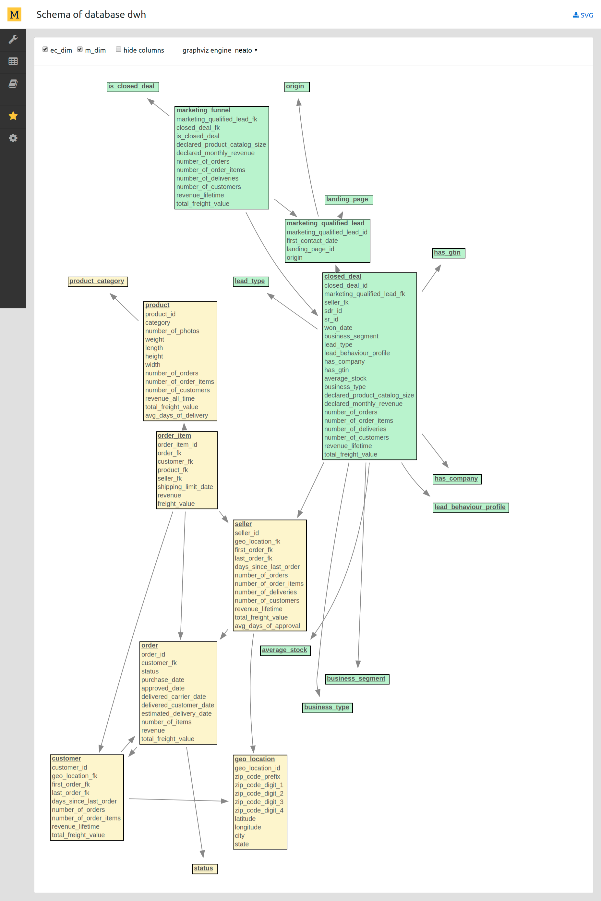
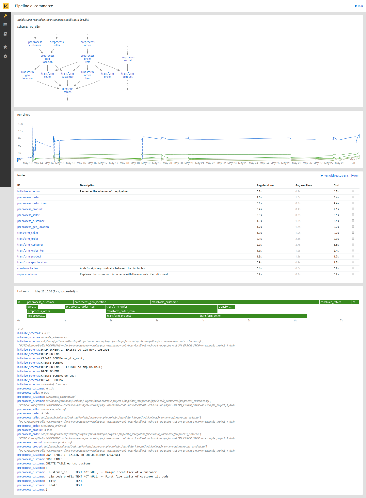

# Mara Example Project 1

A runnable app that demonstrates how to build a data warehouse with mara. 
Combines the [data-integration](https://github.com/mara/data-integration) and 
[mara-schema](https://github.com/mara/mara-schema) libraries 
with the [mara-app](https://github.com/mara/mara-app) framework into a project. 

The example ETL integrates publicly available e-commerce and marketing data into a more general 
modeling and structure for highlighting the capabilities of the Mara framework.

The repository is intended to serve as a template for new projects.

&nbsp;

## Example: E-commerce and marketing data by Olist

The project uses two real, publicly available and anonymized data sources: 

1. The [Brazilian e-commerce dataset by Olist](https://www.kaggle.com/olistbr/brazilian-ecommerce).
Containing information of 100k orders from 2016 to 2018 made at multiple marketplaces in Brazil through the Olist platform,
covering a range of standard e-commerce dimensions and metrics.

2. The [Marketing funnel dataset by Olist](https://www.kaggle.com/olistbr/marketing-funnel-olist). 
Containing information of 8k, randomly sampled Marketing Qualified Leads (MQLs) that requested contact between Jun. 1st 2017 and Jun 1st 2018.
Its features allows viewing a sales process from multiple dimensions: lead category, catalog size, behaviour profile, etc. 

The total size of these data is 121MB and is included as a project requirement from the
[olist-ecommerce-data](https://github.com/mara/olist-ecommerce-data) package for ease of loading.

Then there is the ETL in [app/data_integration/pipelines](app/data_integration/pipelines) that transforms 
this data into a classic Kimball-like [star schema](https://en.wikipedia.org/wiki/Star_schema):



It shows 2 database schemas, each created by a different pipeline: 

- `ec_dim`: Transforms and builds data-sets related to the e-commerce public data by Olist.
- `m_dim`: Transforms and builds the marketing-funnel data-sets based on Olist sellers' marketing funnel and the e-commerce data.

&nbsp;

With this structure in place, it is then possible to run queries like this:

```sql
SELECT seller_id,
       origin,
       first_contact_date::DATE AS first_contact_date,
       won_date::DATE AS won_date,
       seller.number_of_orders,
       seller.number_of_deliveries,
       seller.number_of_customers,
       seller.revenue_lifetime
FROM m_dim.marketing_funnel
     JOIN m_dim.closed_deal USING (marketing_qualified_lead_fk)
     JOIN m_dim.marketing_qualified_lead ON marketing_qualified_lead_fk = marketing_qualified_lead_id
     JOIN ec_dim.seller ON seller_id = seller_fk
LIMIT 10;
```

```
            seller_id             |     origin     | first_contact_date |  won_date  | number_of_orders | number_of_deliveries | number_of_customers | revenue_lifetime 
----------------------------------+----------------+--------------------+------------+------------------+----------------------+---------------------+------------------
 2c43fb513632d29b3b58df74816f1b06 | organic_search | 2018-02-21         | 2018-02-26 |                3 |                    3 |                   3 |              858
 612170e34b97004b3ba37eae81836b4c | organic_search | 2018-04-03         | 2018-06-05 |              107 |                  107 |                 107 |         23065.02
 ed8cb7b190ceb6067227478e48cf8dde | unknown        | 2017-10-09         | 2018-07-03 |               15 |                   15 |                  15 |            573.5
 1c742ac33582852aaf3bcfbf5893abcf | organic_search | 2018-02-06         | 2018-02-07 |                1 |                    1 |                   1 |             97.9
 44ed138eca6214d572ce1d813fb0049b | unknown        | 2018-04-13         | 2018-04-17 |                2 |                    2 |                   2 |           129.79
 87d73636a3acf123e842bb890a4db036 | paid_search    | 2017-10-18         | 2018-04-24 |                1 |                    1 |                   1 |            269.9
 b566ab0ef88016e00422755e305103c6 | paid_search    | 2018-02-21         | 2018-02-23 |                5 |                    5 |                   5 |             1208
 2d2322d842118867781fc737e96d59a1 | direct_traffic | 2018-04-15         | 2018-05-22 |                8 |                    8 |                   8 |            176.4
 9e7c5f4d7770eab65738cca38f9efccf | paid_search    | 2018-04-05         | 2018-04-10 |                2 |                    2 |                   2 |            184.8
 df91910b6a03bb2e3358fa6a35e32f6f | referral       | 2018-04-03         | 2018-04-10 |               14 |                   13 |                  14 |           2312.1
(10 rows)
```

&nbsp;

Mara data integration pipelines are visualized and debugged though a web ui. Here, the pipeline `e_commerce` is run (locally on an Ubuntu 18.04 with all available data): 


&nbsp;

On production, pipelines are run through a cli interface:


&nbsp;

Mara ETL pipelines are completely transparent, both to stakeholders in terms of applied business logic and to data engineers in terms of runtime behavior.

This is the page in the web ui that visualizes the pipeline `e_commerce`: 



It shows 

- a graph of all pipeline children with dependencies between them,
- run times of the pipeline and top child nodes over time,
- a list of all child nodes with their average run time and cost,
- system statistics, a timeline and output of the last runs.

&nbsp;

Similarly, this is the page for the task `e_commerce/transform_order_item`:


It shows its

- direct upstreams and downstreams,
- run times over time,
- all commands of the task,
- system statistics, a timeline and output of the last runs. 

&nbsp;

### Mara Schema

This package [Mara Schema](https://github.com/mara/mara-schema) contains a lightweight opinionated DWH schema management framework which manages business semantics in DWH, automates ETL process and generation of artifacts, and ensures consistency across reporting tools and transparency to DWH users.

The package has a web UI for documentation of business semantic in DWH: Entities, Attributes, Metrics, DataSets, etc.


The file [schema.py](https://github.com/mara/mara-schema/blob/master/mara_schema/schema.py) contains classes for `DataSet`, `Entity`, `Metric`, `Attribute`, etc.
The repository [app/schema](https://github.com/mara/mara-example-project-1/tree/master/app/schema) contains files to create Entity objects and DataSet objects for this example project.

The file [sql_generation.py](https://github.com/mara/mara-schema/blob/master/mara_schema/sql_generation.py) contains functions to generate SQL for flattened tables and Mondrian fact tables. 
Please take a look at the pipeline [generate_artifacts](https://github.com/mara/mara-example-project-1/blob/master/app/data_integration/pipelines/generate_artifacts/__init__.py), which shows an example of using Mara Schema to automate the generation of artifacts:


The following flask command generates a XML file for Mondrian schema in an activated virtual environment.
Please check the [README.md](https://github.com/mara/mara-schema/blob/master/README.md#create-mondrian-schema) for the configuration.

````
$ flask mara_schema.create-mondrian-schema
```` 

&nbsp;

## Getting started

### Sytem requirements

Python >=3.6 and PostgreSQL >=10 and some smaller packages are required to run the example (and mara in general). 

Mac:

```console
$ brew install -v python3
$ brew install -v dialog
$ brew install -v coreutils
$ brew install -v graphviz
```

Ubuntu 16.04:

```console
$ sudo apt install git dialog coreutils graphviz python3 python3-dev python3-venv
```

&nbsp;

Mara does not run Windows.

&nbsp;

On Mac, install Postgresql with `brew install -v postgresql`. On Ubuntu, follow  [these instructions](https://www.postgresql.org/download/linux/ubuntu/). Also, install the [cstore_fdw](https://github.com/citusdata/cstore_fdw) with `brew install cstore_fdw` and [postgresql-hll](https://github.com/citusdata/postgresql-hll) extensions from source.

To optimize PostgreSQL for ETL workloads, update your postgresql.conf along [this example](docs/postgresql.conf).

Start a database client with `sudo -u postgres psql postgres` and then create a user with `CREATE ROLE root SUPERUSER LOGIN;` (you can use any other name).

&nbsp;

### Installation

Clone the repository somewhere. Copy the file [`app/local_setup.py.example`](app/local_setup.py.example) to `app/local_setup.py` and adapt to your machine.

Log into PostgreSQL with `psql -U root postgres` and create three databases:

```sql
CREATE DATABASE example_project_1_dwh;
CREATE DATABASE example_project_1_mara;
CREATE DATABASE olist_ecommerce;
```

Hit `make` in the root directory of the project. This will 

- create a virtual environment in `.venv`,
- install all packages from [`requirements.txt.freeze`](requirements.txt.freeze) (if you want to create a new `requirements.txt.freeze` from [`requirements.txt`](requirements.txt), then run `make update-packages`),
- create a number of tables that are needed for running mara.

You can now activate the virtual environment with 

```console
$ source .venv/bin/activate
```

To list all available flask cli commands, run `flask` without parameters.

&nbsp;

### Running the web UI

```console
$ flask run --with-threads --reload --eager-loading
```

The app is now accessible at [http://localhost:5000](http://localhost:5000).

&nbsp;

### Loading the Olist e-commerce and marketing public data

You can load the data into a Postgres database with:

```console
$ make load-olist-data
```

This will load the data in the `olist_ecommerce` PostgreSQL database, locally.

For more information about the underlying data and for custom downloads, 
visit the [official dataset reference in Kaggle](https://www.kaggle.com/olistbr/brazilian-ecommerce)

&nbsp;

### Running the ETL

For development, it is recommended to run the ETL from the web UI (see above). 
On production, use `flask data_integration.ui.run` to run a pipeline or a set of its child nodes. 

The command `data_integration.ui.run_interactively` provides an ncurses-based menu for selecting and running pipelines.

&nbsp;

## Documentation

Documentation is work in progress. But the code base is quite small and documented.
